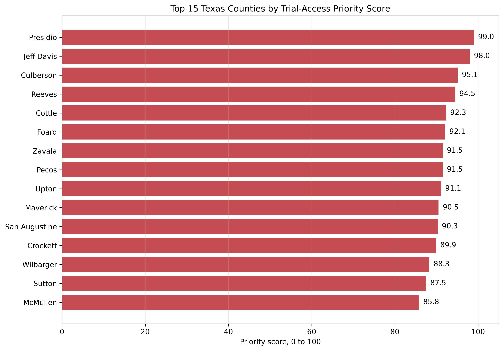
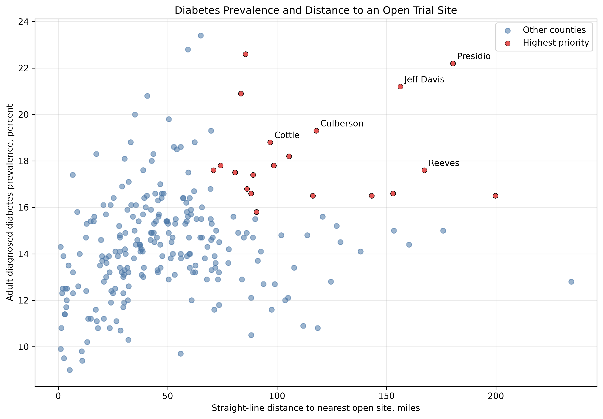
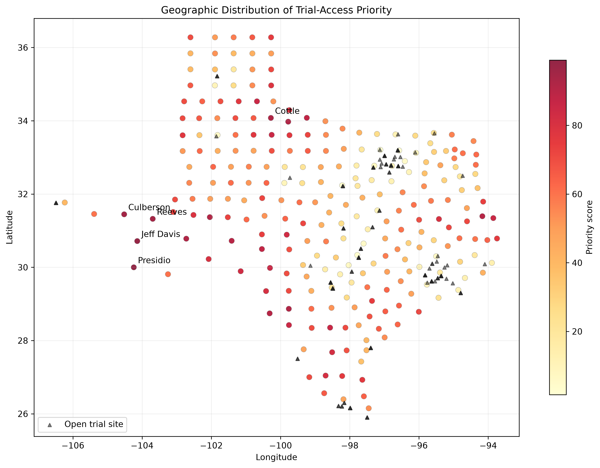
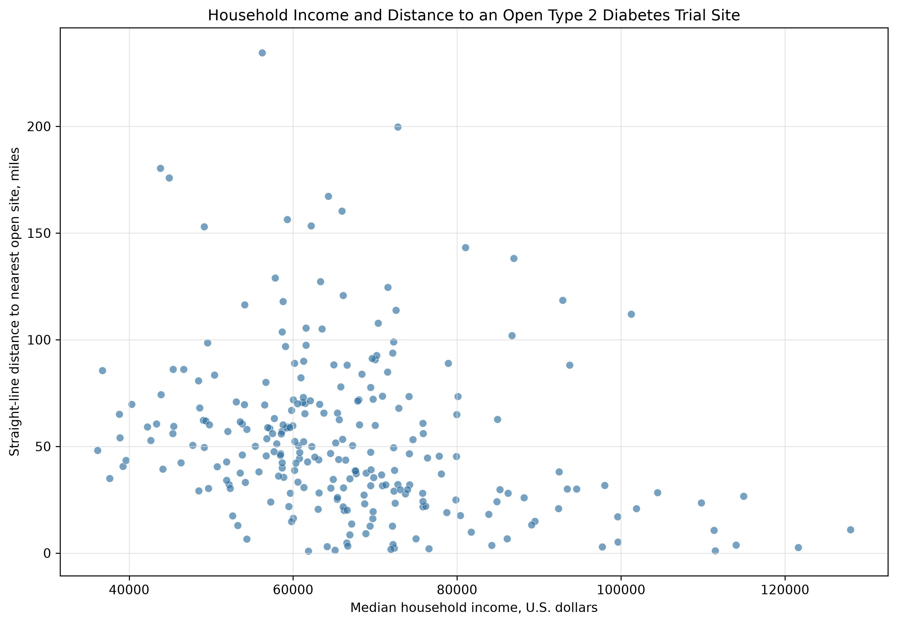
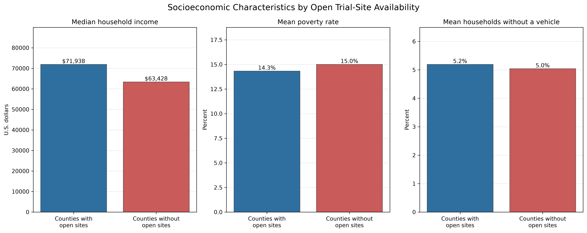

# TrialReach Texas

## Geographic Inequities in Access to Type 2 Diabetes Clinical Trials

TrialReach Texas examines whether Texas counties with high diagnosed diabetes prevalence also face limited geographic access to open Type 2 diabetes clinical trials.

The project combines public data from ClinicalTrials.gov, CDC PLACES, and the U.S. Census Bureau.

## Research question

Which Texas counties have both:

- High diagnosed diabetes prevalence
- Long distance to the nearest open Type 2 diabetes trial site
- No open trial site within the county

Throughout this repository, an "open" site means a site whose facility-level status was `RECRUITING` or `NOT_YET_RECRUITING` in ClinicalTrials.gov at the time of data collection. Sites with blank facility-level status were not classified as open.

## Data sources

### ClinicalTrials.gov

Clinical study records and trial locations were collected through the ClinicalTrials.gov API.

Source: https://clinicaltrials.gov/data-api/api

### CDC PLACES

County-level diagnosed diabetes prevalence estimates came from the 2025 CDC PLACES county release.

Source: https://www.cdc.gov/places/

### U.S. Census Bureau

County identifiers, geographic coordinates, and county assignments came from Census TIGERweb.

Source: https://tigerweb.geo.census.gov/

## Study workflow

1. Download Type 2 diabetes studies linked to Texas.
2. Convert study records into structured CSV files.
3. Identify recruiting and not-yet-recruiting trial sites.
4. Assign each open site to a Texas county.
5. Download county diabetes prevalence estimates.
6. Calculate straight-line distance from each county center to the nearest open trial site.
7. Rank counties using diabetes prevalence and trial-access distance.
8. Generate publication-ready figures.

## Main findings

- 1,231 Texas-linked Type 2 diabetes studies were identified.
- 81 studies had at least one open Texas site.
- 292 Texas trial-site records were explicitly marked as open under the project definition.
- 31 counties had at least one open trial site.
- 222 of the 253 counties in the CDC dataset had no open trial site.
- 87.7% of analyzed counties lacked an open trial site.
- Median distance to the nearest open site was 46.6 miles.
- 117 counties were more than 50 miles from the nearest open site.
- 25 counties were more than 100 miles from the nearest open site.
- Brewster County had the longest estimated distance at 234.5 miles.
- Twenty counties met the highest-priority definition.

## Highest-priority counties

The five leading counties were:

| Rank | County | Priority score | Diabetes prevalence | Nearest open site |
|---:|---|---:|---:|---:|
| 1 | Presidio | 99.0 | 22.2% | 180.4 miles |
| 2 | Jeff Davis | 98.0 | 21.2% | 156.3 miles |
| 3 | Culberson | 95.1 | 19.3% | 117.9 miles |
| 4 | Reeves | 94.5 | 17.6% | 167.3 miles |
| 5 | Cottle | 92.3 | 18.8% | 96.8 miles |

## Priority score

Each county received two percentile rankings:

- Diagnosed diabetes prevalence percentile
- Distance-to-nearest-open-site percentile

The final score gives equal weight to both measures:

```text
Priority score =
(prevalence percentile + distance percentile) / 2
```

A county enters the highest-priority group when:

- Its prevalence percentile is at least 75
- Its distance percentile is at least 75
- It has no open trial site

The score supports geographic screening and research planning. It does not measure causal impact.

## Figures

### Top 15 priority counties



### Diabetes prevalence and trial distance



### Geographic distribution



## Main output files

| File | Description |
|---|---|
| `data/texas_county_priority_scores.csv` | Final ranked county dataset |
| `data/texas_county_trial_access_with_distance.csv` | County access and distance measures |
| `data/texas_open_type_2_diabetes_trial_sites_with_counties.csv` | Open trial sites with county assignments |
| `data/texas_county_diabetes_prevalence.csv` | CDC county diabetes estimates |
| `reports/figures/` | Final charts |

## Reproducing the analysis

Create and activate a Python virtual environment.

Install the required packages:

```bash
python -m pip install -r requirements.txt
```

Run the scripts in this order:

```bash
python download_texas_trials.py
python create_texas_trials_csv.py
python analyze_texas_trials.py
python create_texas_trial_sites_csv.py
python filter_open_trial_sites.py
python assign_sites_to_counties.py
python download_cdc_diabetes.py
python check_missing_county.py
python build_county_access_dataset.py
python download_texas_county_centroids.py
python calculate_nearest_trial_distance.py
python identify_priority_counties.py
python create_visualizations.py
```

## Limitations

- Facility-level recruitment status was blank for 5,357 of 5,656 collected Texas site records. The analysis counts only sites explicitly marked `RECRUITING` or `NOT_YET_RECRUITING` as open.
- ClinicalTrials.gov records depend on information submitted by study sponsors.
- A listed recruiting site might not be actively enrolling at the time of review.
- Trial locations represent study sites, not participant residences.
- Distances are straight-line estimates from county geographic centers. They are not road or travel-time estimates.
- Large counties contain substantial within-county variation.
- CDC PLACES provides modeled prevalence estimates.
- The CDC dataset included 253 Texas counties. Loving County, FIPS 48301, was absent.
- The geographic figure uses county-center points rather than county boundary polygons.
- The analysis identifies geographic associations and access gaps. It does not establish causation.
- No individual patient information was used.

## Public-health relevance

The results identify Texas communities where high diabetes burden overlaps with limited geographic access to open trials. Researchers, health systems, and trial sponsors may use this approach to guide outreach, site-selection research, and future community-engagement studies.

## Skills demonstrated

- Python
- REST APIs
- JSON and CSV processing
- Public-health data integration
- ClinicalTrials.gov data analysis
- Geographic data matching
- Distance calculations
- Reproducible research
- Data-quality assessment
- Data visualization

## Sensitivity analysis

The county priority ranking was tested under five alternative scoring choices:

- Baseline weighting: 50% diabetes prevalence and 50% distance
- Prevalence emphasis: 70% prevalence and 30% distance
- Distance emphasis: 30% prevalence and 70% distance
- Lower priority threshold
- Higher priority threshold

The top-15 ranking was stable across these choices. Four scenarios retained all 15 baseline counties. The prevalence-emphasis and distance-emphasis scenarios each retained 14 of the baseline top 15.

These results suggest the main priority-county findings are not dependent on one weighting choice.

## Socioeconomic analysis

County-level socioeconomic measures were obtained from the 2024 American Community Survey five-year estimates.

The analysis included:

- Median household income
- Poverty percentage
- Percentage of households without a vehicle

Counties with open trial sites had a median household income of approximately $71,938. Counties without open trial sites had a lower median household income of approximately $63,429.

Mean poverty was 14.3% among counties with open sites and 15.0% among counties without open sites.

The correlation between median household income and distance to the nearest open trial site was -0.26. This indicates a modest association in which lower-income counties tended to be farther from open trial sites.

Poverty and vehicle-access measures had weak correlations with distance. These results describe associations and do not establish causation.

## Additional figures

### Household income and trial-site distance



### Socioeconomic comparison by open-site availability



## Project status

This repository contains a completed descriptive analysis of county-level diabetes burden, geographic access to open Type 2 diabetes clinical trial sites, socioeconomic differences, and priority-ranking sensitivity across Texas.

The analysis uses straight-line distance between county centers and trial sites. Future work includes road-based travel-time estimates, county-boundary maps, rurality measures, statistical significance testing, and multivariable modeling.